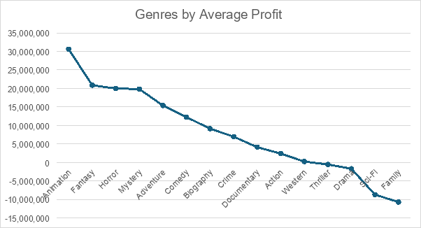

**IMDb Movie Analysis**

**Description**

This project aims to extract insights from the IMDb dataset for rated films. By analyzing various aspects of movies, such as ratings, genres, directors, and more, we aim to uncover interesting patterns and trends in the film industry.

**Installation**

To run this project, you need to have Excel installed on your computer. Additionally, make sure you have the IMDb dataset, which you can download from [IMDb's website](https://www.imdb.com/interfaces/).

**Usage**

1. **Open the IMDb dataset**: Load the dataset into Excel.
1. **Data Cleaning**:
   1. Removed 64 duplicate rows.
   1. Removed outdated data from 1920 to 1989.
   1. Removed an outlier value (South Korean film "Host").
   1. Reduced the dataset from 3588 to 3239 entries.
1. **Calculated Columns**:
   1. Added a column to calculate the profit of each film (gross - budget) in dollars.
1. **Data Transformation**:
   1. Split the genre column and retained only the first genre.
1. **Data Analysis and Visualization**:
   1. Created visualizations for the following
      1. Top 10 most profitable movies.

1. Top 10 IMDb rated movies.

1. Top 5 profitable directors.

1. Top 10 profitable actors.

1. Genre by average profit.

**Contributing**

If you wish to contribute to this project, please fork the repository and submit a pull request. For major changes, please open an issue first to discuss what you would like to change.

